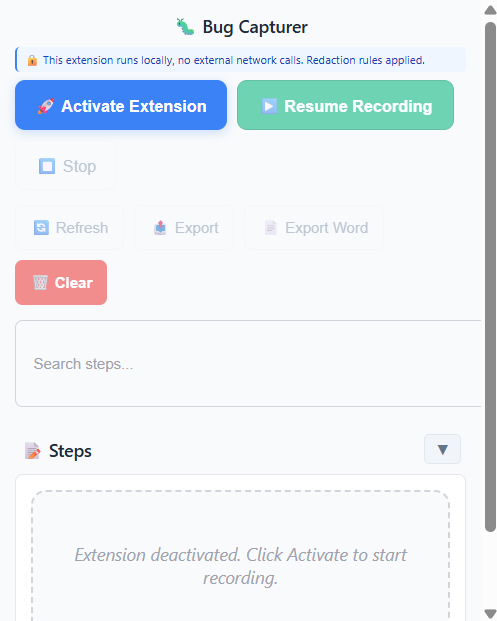
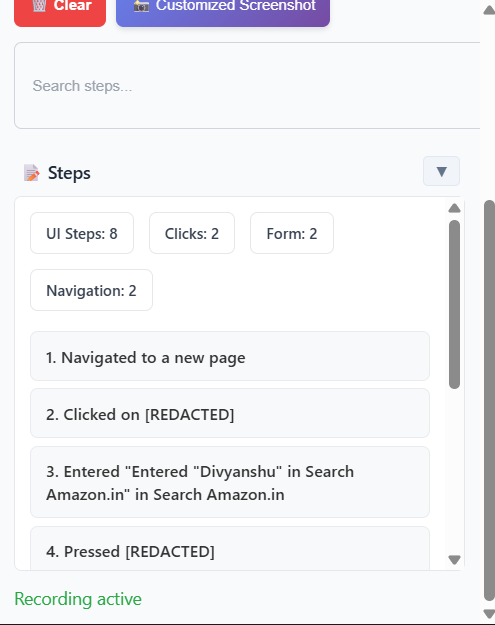

# 🐛 Bug Capturer Extension

A powerful, privacy-focused browser extension for capturing and documenting bugs with comprehensive step-by-step recording, intelligent redaction, and multiple export formats.

## ✨ Features

### 🎯 **Comprehensive Bug Recording**
- **Real-time Step Capture**: Automatically records all user interactions including clicks, form inputs, navigation, and console events
- **Smart Redaction**: Automatically redacts sensitive information like passwords, tokens, and personal data
- **Visual Screenshots**: Capture custom area screenshots, full-page screenshots, and automatic navigation screenshots
- **Performance Monitoring**: Tracks page load times and performance metrics

### 🔒 **Privacy & Security First**
- **100% Local Processing**: No external network calls, all data stays on your device
- **Intelligent Redaction**: Conservative redaction rules that protect sensitive data without over-redacting
- **Secure Storage**: Uses Chrome's local storage API for data persistence
- **No Data Collection**: Zero telemetry or data sharing

### 📊 **Advanced Analytics**
- **Step Statistics**: Detailed breakdown of interaction types (clicks, forms, navigation, errors)
- **Duration Tracking**: Automatic timing of bug reproduction sessions
- **Error Detection**: Captures JavaScript errors and warnings
- **Performance Metrics**: Monitors page load times and responsiveness

### 📤 **Multiple Export Formats**
- **Markdown Reports**: Clean, readable bug reports with embedded screenshots
- **Word Documents**: Professional Word (.docx) reports with formatted content
- **JSON Export**: Raw data export for integration with other tools
- **Screenshot Gallery**: Organized screenshot management with modal viewing

## 🚀 Quick Start

### Installation

1. **Download the Extension**
   - Clone or download this repository
   - Extract the `bug-capturer-ext` folder

2. **Load in Chrome/Edge**
   - Open Chrome/Edge and navigate to `chrome://extensions/`
   - Enable "Developer mode" in the top right
   - Click "Load unpacked" and select the `bug-capturer-ext` folder

3. **Pin the Extension**
   - Click the puzzle piece icon in your browser toolbar
   - Find "Bug Capturer Extension" and click the pin icon


### Basic Usage

1. **Activate Recording**
   - Click the Bug Capturer extension icon
   - Click "🚀 Activate Extension" to start recording

2. **Reproduce the Bug**
   - Navigate to the problematic webpage
   - Perform the steps that reproduce the bug
   - The extension automatically captures all interactions

3. **Capture Screenshots** (Optional)
   - Click "📸 Customized Screenshot" for advanced screenshot options
   - Choose custom area selection or full-page capture
   - Screenshots are automatically organized and timestamped

4. **Export Your Report**
   - Click "📤 Export" for Markdown format
   - Click "📄 Export Word" for Word document format
   - Reports include all steps, screenshots, and metadata


## 🎨 User Interface

### Main Control Panel

The extension features a clean, intuitive interface designed for efficiency:


*Add main interface screenshot here*

**Key Components:**
- **Activation Controls**: Start, pause, resume, and stop recording
- **Action Buttons**: Refresh, export, clear, and screenshot options
- **Search Functionality**: Quick step filtering and search
- **Steps Display**: Real-time step tracking with collapsible view
- **Status Indicator**: Current recording state and statistics

### Screenshot Management

Advanced screenshot capabilities with organized gallery:


*Add screenshot gallery interface here*

**Screenshot Features:**
- **Custom Area Selection**: Click and drag to select specific areas
- **Full-Page Capture**: Automatic full-page screenshots
- **Navigation Screenshots**: Auto-capture on page changes
- **Gallery View**: Organized thumbnail grid with metadata
- **Modal Viewer**: Full-screen image viewing with navigation

### Step Tracking

Real-time step monitoring with intelligent categorization:


*Add step tracking interface here*

**Step Types:**
- **🖱️ Click Actions**: Button clicks, link navigation, form submissions
- **📝 Form Interactions**: Input field changes, dropdown selections
- **🧭 Navigation**: Page changes, URL updates, tab switches
- **⚠️ Errors**: JavaScript errors and warnings
- **📊 Performance**: Page load times and metrics
- **💬 Console**: Console logs and debug information

## 📋 Detailed Features

### 🔍 Smart Redaction System

The extension includes intelligent redaction to protect sensitive information:

```javascript
// Redaction patterns for sensitive data
const SENSITIVE_PATTERNS = /password|pwd|secret|token|key|ssn|creditcard|credit-card|cardnumber|card-number/i;
```

**Redaction Features:**
- **Automatic Detection**: Identifies sensitive form fields by name/ID
- **Conservative Approach**: Only redacts truly sensitive information
- **Context Preservation**: Maintains field identification while protecting values
- **Customizable Rules**: Easy to modify redaction patterns

### 📊 Advanced Statistics

Comprehensive analytics for bug analysis:

**Metrics Tracked:**
- **Total UI Steps**: Count of meaningful user interactions
- **Action Breakdown**: Clicks, forms, navigation, errors
- **Duration**: Total time spent reproducing the bug
- **Error Count**: Number of JavaScript errors encountered
- **Performance**: Page load times and responsiveness metrics

### 🎯 Custom Screenshot Selection

Interactive screenshot capture with precise area selection:


**Selection Features:**
- **Click and Drag**: Intuitive area selection
- **Real-time Preview**: Live selection rectangle
- **Dimension Display**: Shows selection size in pixels
- **Keyboard Shortcuts**: Enter for full-page, Escape to cancel
- **High-Quality Output**: Optimized image compression

### 📄 Export Formats

Multiple export options for different use cases:

#### Markdown Export
```markdown
# Issue on example.com/login

## 📊 Statistics
- **Total UI Steps:** 5
- **Click Actions:** 3
- **Form Interactions:** 2
- **Duration:** 30 seconds

## 📝 Steps to Reproduce
1. User clicked on email input field
2. User entered "user@example.com"
3. User clicked on password input field
4. User entered "••••••••"
5. User clicked on Login button
```

#### Word Document Export
Professional Word documents with:
- **Formatted Headers**: Clean section organization
- **Embedded Screenshots**: High-quality image integration
- **Step Numbering**: Clear reproduction instructions
- **Metadata Tables**: Environment and technical details


## 🛠️ Technical Details

### Architecture

The extension follows a modular architecture:

```
bug-capturer-ext/
├── manifest.json          # Extension configuration
├── background.js          # Service worker for data management
├── content-script.js      # Page interaction capture
├── controller.html        # Main UI interface
├── popup.js              # UI logic and controls
├── word-report-generator.js # Word document generation
└── icons/                # Extension icons
```

### Browser Compatibility

- **Chrome**: Version 88+ (Manifest V3)
- **Edge**: Version 88+ (Chromium-based)
- **Firefox**: Not currently supported (Manifest V2)
- **Safari**: Not currently supported

### Permissions

The extension requires minimal permissions:

```json
{
  "permissions": [
    "storage",      // Local data persistence
    "scripting",    // Content script injection
    "activeTab",    // Current tab access
    "tabs",         // Tab management
    "downloads"     // File export
  ],
  "host_permissions": [
    "<all_urls>"    // Universal page access
  ]
}
```

### Data Storage

All data is stored locally using Chrome's storage API:

- **Storage Type**: `chrome.storage.local`
- **Data Format**: JSON with compressed screenshots
- **Retention**: Persistent until manually cleared
- **Size Limits**: Optimized for Chrome's storage quotas

## 🔧 Configuration

### Customizing Redaction Rules

Edit `content-script.js` to modify redaction patterns:

```javascript
// Add custom sensitive patterns
const SENSITIVE_PATTERNS = /password|pwd|secret|token|key|ssn|creditcard|your-custom-pattern/i;

// Adjust input length limits
const MAX_INPUT_LENGTH = 100; // Increase for longer field values
```

### Screenshot Quality Settings

Modify screenshot compression in `background.js`:

```javascript
// Adjust compression quality (0.1 - 1.0)
const quality = 0.7;

// Set maximum dimensions
const maxWidth = 1920;
const maxHeight = 1080;
```

### UI Customization

The interface can be customized by modifying `controller.html`:

- **Colors**: Update CSS variables for theme changes
- **Layout**: Modify grid and flexbox properties
- **Typography**: Adjust font families and sizes
- **Animations**: Customize transition effects

## 🚨 Troubleshooting

### Common Issues

**Extension Not Recording Steps**
- Ensure the extension is activated (blue "Activate Extension" button)
- Check that the page has finished loading
- Verify the extension has necessary permissions

**Screenshots Not Capturing**
- Ensure the page is not in an iframe
- Check for content security policy restrictions
- Verify sufficient storage space

**Export Not Working**
- Ensure popup blockers are disabled
- Check browser download permissions
- Verify sufficient disk space

**Performance Issues**
- Clear old steps using the "Clear" button
- Reduce screenshot quality in settings
- Close unnecessary browser tabs

### Debug Mode

Enable debug logging by opening Developer Tools:

1. Right-click the extension icon
2. Select "Inspect popup"
3. Check the Console tab for detailed logs

## 🤝 Contributing

We welcome contributions! Here's how to get started:

### Development Setup

1. **Clone the Repository**
   ```bash
   git clone https://github.com/your-username/bug-capturer-extension.git
   cd bug-capturer-extension
   ```

2. **Load in Development Mode**
   - Follow the installation steps above
   - Enable "Developer mode" in Chrome extensions
   - Load the `bug-capturer-ext` folder

3. **Make Changes**
   - Edit the source files
   - Test in the browser
   - Reload the extension to see changes

### Code Structure

- **`popup.js`**: Main UI logic and user interactions
- **`content-script.js`**: Page interaction capture and redaction
- **`background.js`**: Data storage and screenshot processing
- **`controller.html`**: UI markup and styling
- **`word-report-generator.js`**: Word document generation

### Pull Request Process

1. Fork the repository
2. Create a feature branch
3. Make your changes
4. Test thoroughly
5. Submit a pull request

## 🙏 Acknowledgments

- **html2canvas**: For screenshot capture functionality
- **JSZip & FileSaver**: For file export capabilities
- **docx**: For Word document generation
- **Chrome Extensions API**: For browser integration

## 📞 Support

- **Issues**: Report bugs and request features on GitHub Issues
- **Documentation**: Check this README for detailed usage instructions
- **Community**: Join discussions in GitHub Discussions

---

**Made with ❤️ for better bug reporting and testing workflows**
